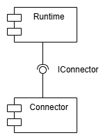
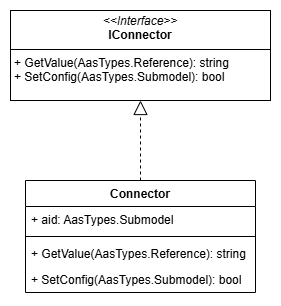

# Asset Connector Template

In here you can find a template for implementing the asset connector.
The example is given in two programming languages:

- [Python](python-connector-template/README.md)
- [C#](csharp-connector-template/README.md)

Refer to the `README.md` file in the respective subdirectory for further deployment instructions.

## Overview

The Connector is supposed to interact with the Runtime through the `IConnector` interface:



The Connector has to implement that interface:



## Testing

The `IConnector` interface is currently implemented through a HTTP API.

## Request Structure

The implementations support two requests
* POST `/set-config`
* POST `/get-value`

In both cases, a JSON payload has to be passed
```json
{
    "jsonContent": "..."
}
```

In the `jsonContent` field, the `...` have to be replaced with the actual content.
This content is either
* A complete JSON-serialized AID submodel (for the `/set-config` endpoint)
* A JSON-serialized AAS Reference to a property in the AID (for the `/get-value` endpoint)

That means, a JSON-serialized object (AID or Reference) is wrapped as string inside a JSON payload.
This ensures that the application can freely choose a way to deserialize the `jsonContent`.

Therefore, the JSON-serialized AID / Reference _cannot_ be put in there as JSON text: The `"` symbol must be escaped as `\"` and all line breaks need to be removed.
Ultimately, it becomes a compact single-line JSON string with proper escaping which can be treated as any other string.

Examples for both (AID and Reference) encoded as JSON string with proper escaping can be found in
* `requests/BallPenMachine_AID_asPayload.txt`
* `requests/ReferenceToAid_asPayload.txt`


## Postman

You can import the Postman collection `requests/PostmanCollection.json` which already contains two request examples according to the specification explained above.